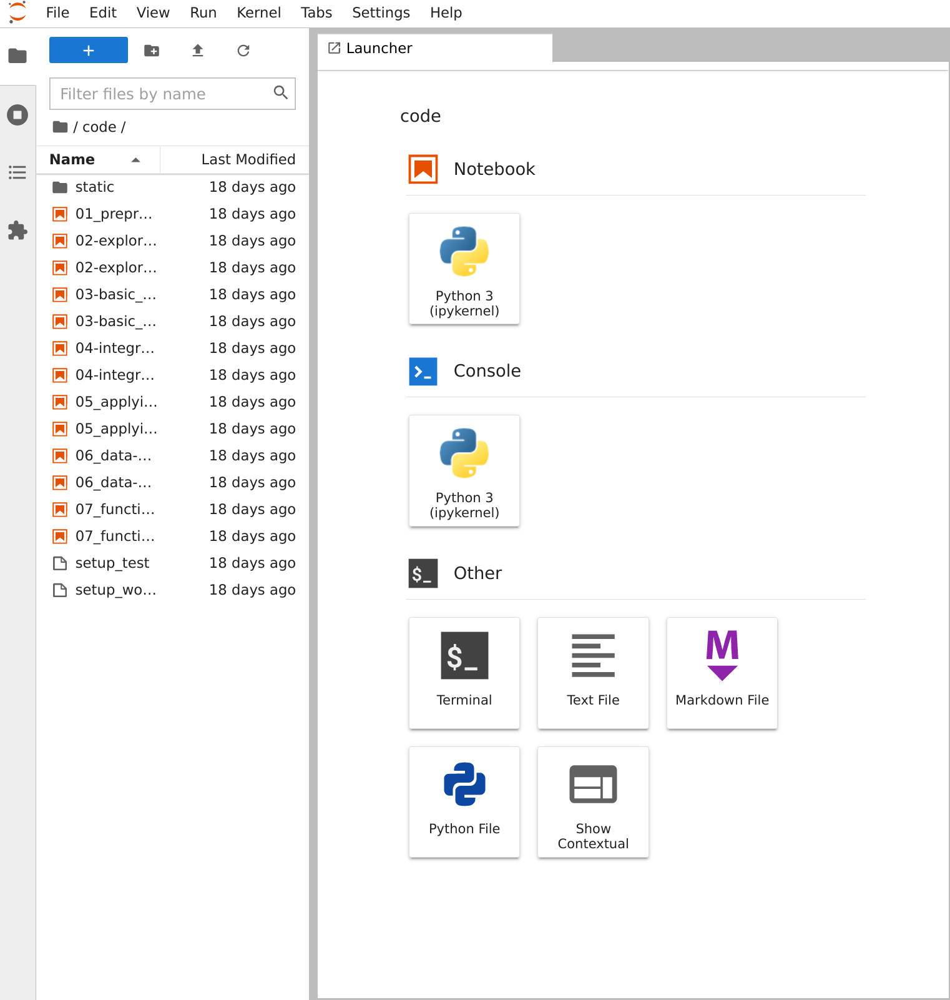
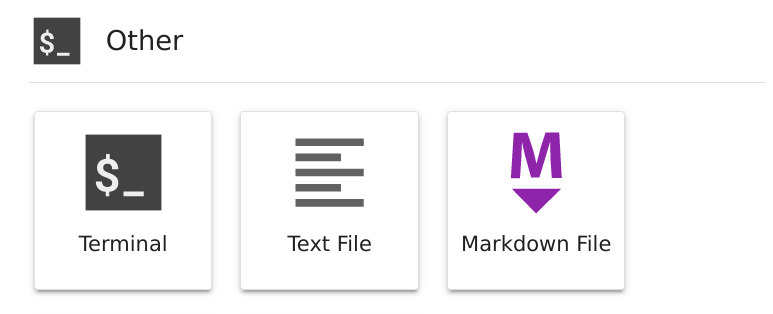
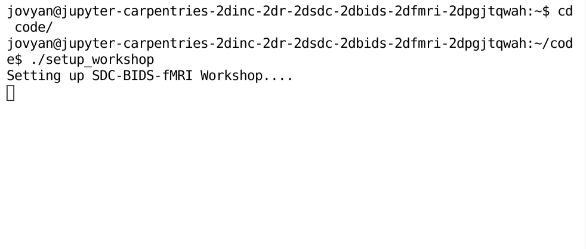

# fMRI lab 2022

## Content to run tutorial "Functional connectivity"
[](https://mybinder.org/v2/gh/dr-xenia/fmri_lab/HEAD)

---
# Setting up the tutorial environment

## Binder

Using Binder is the easiest and fastest way to get started with the workshop. Binder is a virtual environment containing the full computing environment required in order to go through the workshop. Note that Binder hosts the environment on a cloud server and therefore internet access is required to launch it.

### Setting up Binder

#### **Step 1**:

Click the link here to spin up the workshop environment: [Binder Workshop](https://mybinder.org/v2/gh/carpentries-incubator/SDC-BIDS-fMRI/gh-pages?urlpath=lab/tree/code)
You will see an interface that looks like the following:



The left-hand pane shows a list of workshop notebooks that contain the content of the workshop itself. Before jumping into the workshop notebooks we need to perform a setup step to pull the neuroimaging data that will be used in the workshop...

#### **Step 2**:

Once the environment is launched click the "Terminal" button under "Other". 



Clicking on this will launch a console. From here, copy and paste the following lines 

```{bash}
# Move into the code directory
cd code

# Run the setup_workshop script
./setup_workshop
```

Hit enter once pasted and you should see the following



This will begin downloading the data required for the workshop onto your Binder instance so that it is usable for the workshop. Once started *do not close the tab by pressing the "x" button.* Instead, you may now open and begin working through the workshop notebooks.
